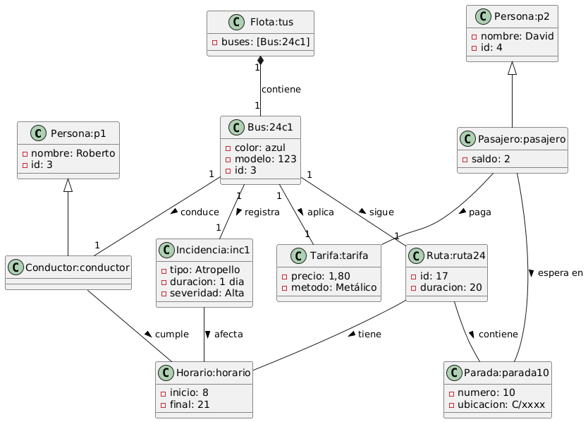
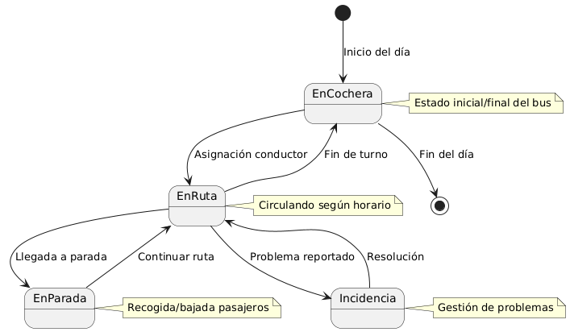

### Nota importante
Al exportar los .svg de los modelos me daba un error, así que los he tenido que exportar en formato .png

# [Examen escaneado (click para ver)](images/README.md)

# Modelo del dominio

## [Diagrama de clases](modelosUML/DdCV2.puml)

## [Diagrama de Objetos](modelosUML/DdOV2.puml)

## [Diagrama de Estados (Autobús)](modelosUML/DdEV2.puml)

